<!-- 
🎯 ENTERPRISE LEVEL ANIMATED GITHUB PROFILE
🚀 Git-Spider | Full Stack Developer & Innovation Architect
⚡ Dynamic Animations | Vector Graphics | Live Stats
-->

<!-- ANIMATED HEADER WITH GRADIENT TEXT -->
<svg width="100%" height="200" xmlns="http://www.w3.org/2000/svg">
  <defs>
    <linearGradient id="textGrad" x1="0%" y1="0%" x2="100%" y2="0%">
      <stop offset="0%" style="stop-color:#ff6b6b">
        <animate attributeName="stop-color" 
                 values="#ff6b6b;#4ecdc4;#45b7d1;#96ceb4;#ffeaa7;#dda0dd;#ff6b6b" 
                 dur="4s" repeatCount="indefinite"/>
      </stop>
      <stop offset="50%" style="stop-color:#4ecdc4">
        <animate attributeName="stop-color" 
                 values="#4ecdc4;#45b7d1;#96ceb4;#ffeaa7;#dda0dd;#ff6b6b;#4ecdc4" 
                 dur="4s" repeatCount="indefinite"/>
      </stop>
      <stop offset="100%" style="stop-color:#45b7d1">
        <animate attributeName="stop-color" 
                 values="#45b7d1;#96ceb4;#ffeaa7;#dda0dd;#ff6b6b;#4ecdc4;#45b7d1" 
                 dur="4s" repeatCount="indefinite"/>
      </stop>
    </linearGradient>
    
    <!-- SPIDER WEB ANIMATION -->
    <pattern id="webPattern" x="0" y="0" width="100" height="100" patternUnits="userSpaceOnUse">
      <circle cx="50" cy="50" r="2" fill="#ffffff" opacity="0.3">
        <animate attributeName="opacity" values="0.3;1;0.3" dur="2s" repeatCount="indefinite"/>
      </circle>
      <line x1="50" y1="50" x2="100" y2="50" stroke="#ffffff" stroke-width="0.5" opacity="0.2">
        <animate attributeName="opacity" values="0.2;0.8;0.2" dur="3s" repeatCount="indefinite"/>
      </line>
      <line x1="50" y1="50" x2="75" y2="25" stroke="#ffffff" stroke-width="0.5" opacity="0.2">
        <animate attributeName="opacity" values="0.2;0.8;0.2" dur="2.5s" repeatCount="indefinite"/>
      </line>
    </pattern>
  </defs>
  
  <!-- BACKGROUND ANIMATION -->
  <rect width="100%" height="200" fill="#0d1117">
    <animate attributeName="fill" 
             values="#0d1117;#161b22;#21262d;#161b22;#0d1117" 
             dur="6s" repeatCount="indefinite"/>
  </rect>
  
  <!-- WEB PATTERN OVERLAY -->
  <rect width="100%" height="200" fill="url(#webPattern)" opacity="0.1"/>
  
  <!-- MAIN TITLE -->
  <text x="50%" y="80" text-anchor="middle" font-family="'Courier New', monospace" 
        font-size="48" font-weight="bold" fill="url(#textGrad)">
    <tspan>🕷️ Git-Spider</tspan>
    <animate attributeName="y" values="80;85;80" dur="2s" repeatCount="indefinite"/>
  </text>
  
  <!-- SUBTITLE WITH TYPEWRITER EFFECT -->
  <text x="50%" y="120" text-anchor="middle" font-family="'Arial', sans-serif" 
        font-size="18" fill="#58a6ff">
    <tspan>Enterprise Full Stack Developer</tspan>
    <animate attributeName="opacity" values="1;0.5;1" dur="1.5s" repeatCount="indefinite"/>
  </text>
  
  <!-- ANIMATED UNDERLINE -->
  <line x1="30%" y1="140" x2="70%" y2="140" stroke="url(#textGrad)" stroke-width="3">
    <animate attributeName="x1" values="30%;50%;30%" dur="3s" repeatCount="indefinite"/>
    <animate attributeName="x2" values="70%;50%;70%" dur="3s" repeatCount="indefinite"/>
  </line>
  
  <!-- FLOATING PARTICLES -->
  <circle cx="15%" cy="50" r="3" fill="#ff6b6b" opacity="0.7">
    <animateTransform attributeName="transform" type="translate" 
                      values="0,0;10,20;0,0" dur="4s" repeatCount="indefinite"/>
    <animate attributeName="opacity" values="0.7;1;0.7" dur="2s" repeatCount="indefinite"/>
  </circle>
  
  <circle cx="85%" cy="50" r="4" fill="#4ecdc4" opacity="0.7">
    <animateTransform attributeName="transform" type="translate" 
                      values="0,0;-15,15;0,0" dur="5s" repeatCount="indefinite"/>
    <animate attributeName="opacity" values="0.7;1;0.7" dur="2.5s" repeatCount="indefinite"/>
  </circle>
  
  <circle cx="50%" cy="170" r="2" fill="#45b7d1" opacity="0.8">
    <animateTransform attributeName="transform" type="translate" 
                      values="0,0;20,-10;0,0" dur="3s" repeatCount="indefinite"/>
  </circle>
</svg>

---

## 🌐 **Digital Architecture & Innovation**

<!-- ANIMATED TECH STACK DISPLAY -->

### 🎯 **Core Technologies**

<!-- TECH STACK BADGES WITH ANIMATIONS -->

**Languages & Frameworks**

**Cloud & DevOps**

---

## 📊 **Performance Analytics**

<!-- DYNAMIC STATS CARDS -->

<!-- LANGUAGE STATS -->

---

## 🚀 **Enterprise Solutions Portfolio**

### **🏗️ Architecture Highlights**

```mermaid
graph TD
    A[🌐 Frontend Layer] --> B[⚡ API Gateway]
    B --> C[🏢 Microservices]
    C --> D[📊 Database Layer]
    C --> E[☁️ Cloud Services]
    E --> F[🔐 Security Layer]
    F --> G[📈 Analytics]
    
    style A fill:#ff6b6b
    style B fill:#4ecdc4
    style C fill:#45b7d1
    style D fill:#96ceb4
    style E fill:#ffeaa7
    style F fill:#dda0dd
    style G fill:#ff9ff3
```

### **💼 Professional Expertise**

- 🏗️ **Enterprise Architecture**: Scalable microservices, event-driven systems
- ☁️ **Cloud Solutions**: Multi-cloud deployment strategies (AWS, GCP, Azure)
- 🔒 **Security First**: Zero-trust architecture, compliance frameworks
- 📊 **Data Engineering**: Real-time analytics, ML/AI integration
- 🚀 **DevOps Excellence**: CI/CD pipelines, Infrastructure as Code
- 🎯 **Performance Optimization**: Sub-second response times, 99.9% uptime

---

## 🌟 **Innovation Metrics**

<!-- DYNAMIC CONTRIBUTION GRAPH -->

<!-- PROFILE VIEWS COUNTER -->

<!-- ANIMATED FOLLOWERS -->

---

## 🤝 **Enterprise Collaboration**

<!-- CONTACT MATRIX -->
<table>
<tr>
<td align="center">

**🌐 Professional Network**

</td>
<td align="center">

**💼 Business Solutions**

</td>
</tr>
</table>

---

<!-- FOOTER ANIMATION -->
<svg width="100%" height="80" xmlns="http://www.w3.org/2000/svg">
  <defs>
    <linearGradient id="footerGrad" x1="0%" y1="0%" x2="100%" y2="0%">
      <stop offset="0%" style="stop-color:#ff6b6b;stop-opacity:0.8">
        <animate attributeName="stop-color" 
                 values="#ff6b6b;#4ecdc4;#45b7d1;#ff6b6b" 
                 dur="3s" repeatCount="indefinite"/>
      </stop>
      <stop offset="100%" style="stop-color:#4ecdc4;stop-opacity:0.8">
        <animate attributeName="stop-color" 
                 values="#4ecdc4;#45b7d1;#ff6b6b;#4ecdc4" 
                 dur="3s" repeatCount="indefinite"/>
      </stop>
    </linearGradient>
  </defs>
  
  <rect width="100%" height="80" fill="url(#footerGrad)" opacity="0.1"/>
  
  <text x="50%" y="30" text-anchor="middle" font-family="'Courier New', monospace" 
        font-size="16" fill="#58a6ff" font-weight="bold">
    🕸️ "Weaving the future of enterprise technology" 🕸️
  </text>
  
  <text x="50%" y="55" text-anchor="middle" font-family="Arial" 
        font-size="12" fill="#8b949e">
    ⚡ Always innovating • Always learning • Always delivering ⚡
  </text>
  
  <!-- PULSING DOT -->
  <circle cx="50%" cy="65" r="3" fill="#4ecdc4">
    <animate attributeName="r" values="3;6;3" dur="2s" repeatCount="indefinite"/>
    <animate attributeName="opacity" values="1;0.3;1" dur="2s" repeatCount="indefinite"/>
  </circle>
</svg>

**💫 Transforming Ideas into Enterprise Solutions 💫**

---

*"In the web of technology, every connection creates infinite possibilities"* 🕷️✨

