<!-- 
🎯 ENTERPRISE LEVEL ANIMATED GITHUB PROFILE
🚀 Git-Spider | Full Stack Developer & Innovation Architect
⚡ Dynamic Animations | Vector Graphics | Live Stats
-->

<!-- ANIMATED HEADER WITH TYPING EFFECT -->
<h1>
  
</h1>

<!-- ANIMATED SUBTITLE -->

<!-- SPIDER WEB DIVIDER -->

---

## 🌐 **Digital Architecture & Innovation**

<!-- ANIMATED ROLE DISPLAY -->

<!-- ANIMATED DEVELOPER GIF -->

### 🎯 **Core Technologies**

<!-- TECH STACK ICONS WITH ANIMATION -->

<!-- ANIMATED TECH BADGES -->

  
  
  
  
  
  

  
  
  
  

---

## 📊 **Performance Analytics**

<table>
<tr>
<td>

<!-- GITHUB STATS CARD -->

</td>
<td>

<!-- STREAK STATS -->

</td>
</tr>
</table>

<!-- TOP LANGUAGES -->

---

## 🚀 **Enterprise Solutions Portfolio**

### **🏗️ System Architecture**

```mermaid
graph TD
    A[🌐 Frontend Layer] --> B[⚡ API Gateway]
    B --> C[🏢 Microservices]
    C --> D[📊 Database Layer]
    C --> E[☁️ Cloud Services]
    E --> F[🔐 Security Layer]
    F --> G[📈 Analytics]
    
    style A fill:#ff6b6b,stroke:#fff,stroke-width:2px,color:#fff
    style B fill:#4ecdc4,stroke:#fff,stroke-width:2px,color:#fff
    style C fill:#45b7d1,stroke:#fff,stroke-width:2px,color:#fff
    style D fill:#96ceb4,stroke:#fff,stroke-width:2px,color:#fff
    style E fill:#ffeaa7,stroke:#000,stroke-width:2px,color:#000
    style F fill:#dda0dd,stroke:#fff,stroke-width:2px,color:#fff
    style G fill:#ff9ff3,stroke:#fff,stroke-width:2px,color:#fff
```

### **💼 Professional Expertise**

<table>
<tr><td>

**🏗️ Enterprise Architecture**
- Scalable microservices design
- Event-driven architectures
- Domain-driven development
- System integration patterns

</td><td>

**☁️ Cloud Solutions** 
- Multi-cloud strategies (AWS, GCP, Azure)
- Serverless architectures
- Infrastructure automation
- Cost optimization

</td></tr>
<tr><td>

**🔒 Security & Compliance**
- Zero-trust architecture
- DevSecOps implementation
- Compliance frameworks
- Risk assessment

</td><td>

**📊 Data & Analytics**
- Real-time data processing
- ML/AI integration
- Business intelligence
- Performance monitoring

</td></tr>
</table>

---

## 🌟 **Innovation Metrics**

<!-- CONTRIBUTION GRAPH -->

<!-- ALTERNATIVE CONTRIBUTION DISPLAY -->

<!-- PROFILE METRICS -->

---

## 🤝 **Enterprise Collaboration**

<!-- PROFESSIONAL NETWORK -->
<table>
<tr>
<td align="center" width="50%">

**🌐 Professional Network**

</td>
<td align="center" width="50%">

**💼 Business Solutions**

</td>
</tr>
</table>

---

<!-- ANIMATED WAVE FOOTER -->

### **💫 Transforming Ideas into Enterprise Solutions**

<!-- CODING ACTIVITY GIF -->

